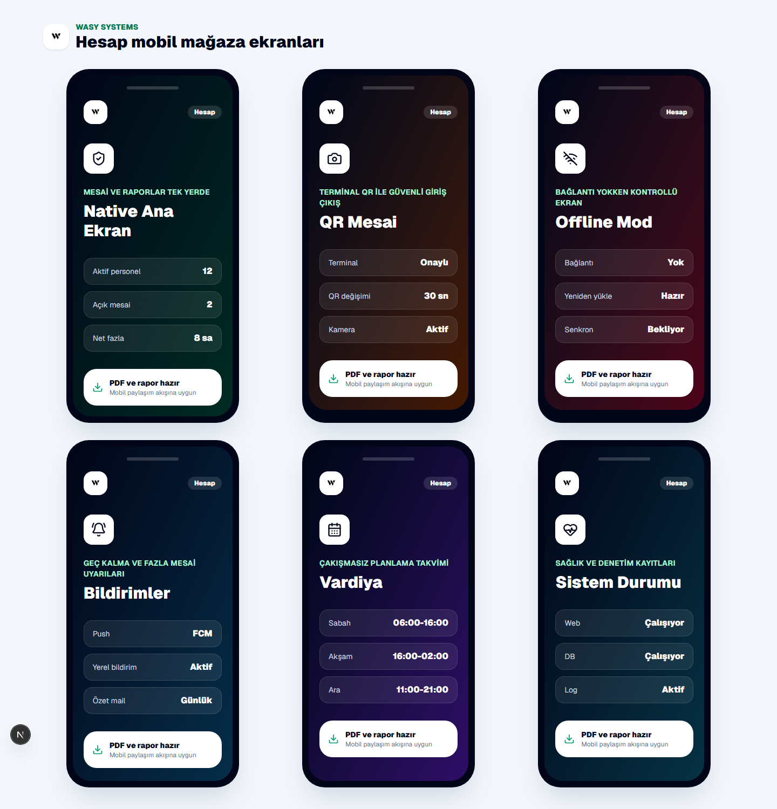
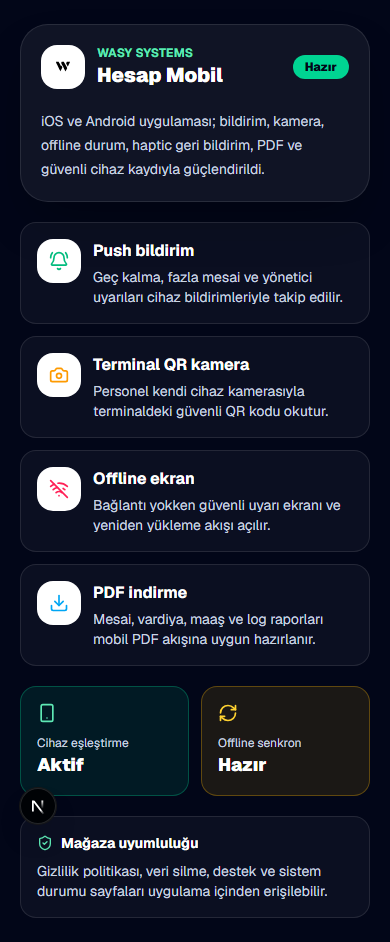
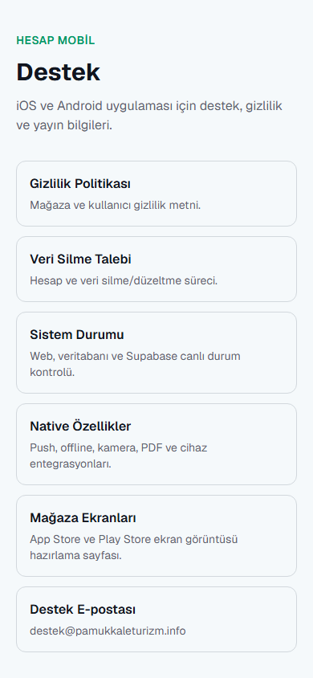
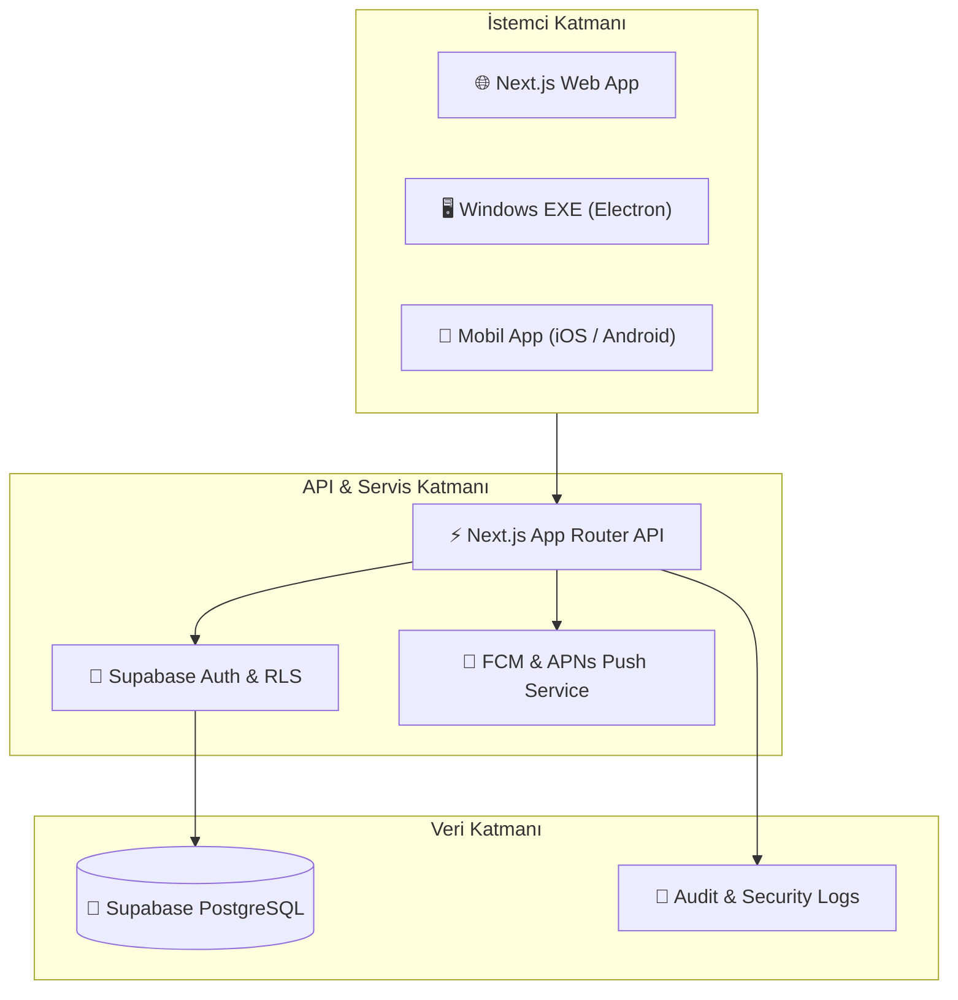

# Hesap Rapor Sistemi

<p align="center">
  
</p>

<p align="center">
  <strong>Gelir, gider, kargo cari, vardiya, QR mesai, maaş, cihaz lisanslama ve yedeklemeyi tek panelde buluşturan modern işletme yönetim sistemi.</strong>
</p>

<p align="center">
  <a href="https://github.com/wasycim/hesap"></a>
  
  
  
  
  
</p>

<p align="center">
  
  
</p>

---

## 📌 Özet

**Hesap Rapor Sistemi**; şube bazlı gelir/gider finans takibi, QR destekli personel mesai kontrolü, vardiya planlama, maaş & kıst prim hesaplama, kargo cari takibi, PDF raporlama, anlık bildirim (FCM & APNs), cihaz bazlı lisanslama ve otomatik yedekleme özelliklerini bünyesinde barındıran tam kapsamlı bir üretim projesidir.

Sistem Web, Windows EXE (Electron) ve Mobil (iOS / Android React Native) katmanlarında aynı iş mantığını çalıştırır.

---

## ✨ Öne Çıkan Özellikler

- 💳 **Finans & Gider Yönetimi:** Şube bazlı gelir-gider takibi, dinamik sütun özelleştirmeleri ve sıralı tarih akışı.
- 👥 **Personel & Maaş Hakediş:** Maaş, mesai, avans, çorba gideri ve ay ortasında ayrılan personeller için **kıst (orantılı) kargo prim** hesabı.
- 📅 **İşten Çıkış & Akıllı Takvim:** Modern Türkçe tarih seçici bileşeni (`ExitDatePicker`), çıkış yapan personelin otomatik pasife alınması ve geçmiş dönem hakediş loglarının eksiksiz korunması.
- 📦 **Kargo Cari & Prim Takibi:** Kargo firmaları borç özeti, KDV & sigorta kesintili prim havuzu dağıtımı ve PDF rapor çıktısı.
- 📷 **QR & Terminal Mesai:** Terminal QR kod okuyucu ve mobil kamera ile personel mesai giriş/çıkış takibi.
- 📱 **Lisanslı Cihaz Yönetimi:** Lisans yönetimi sadece **iOS, Android ve EXE (Windows)** masaüstü uygulamalarını kapsar; web tarayıcı oturumları listeden filtrelenir.
- 💾 **Yedekleme & Çevrimdışı Senkronizasyon:** İnternet kopsa dahi yerel kuyruğa alınan offline işlemler ve günlük JSON veritabanı yedeklemesi.

---

## 🖼️ Uygulama Önizleme & Görseller

<details>
  <summary>📸 <strong>Store ve Mobil Uygulama Ekranları (Genişletmek için tıklayın)</strong></summary>
  <br />
  <p align="center">
    
  </p>
  <p align="center">
    
    &nbsp;&nbsp;
    
  </p>
</details>

---

## 📐 Sistem Mimarisi


```mermaid
flowchart TD
    subgraph Client["İstemci Katmanı"]
        WEB["🌐 Next.js Web App"]
        EXE["🖥️ Windows EXE (Electron)"]
        MOB["📱 Mobil App (iOS / Android)"]
    end

    subgraph Backend["API & Servis Katmanı"]
        API["⚡ Next.js App Router API"]
        AUTH["🔐 Supabase Auth & RLS"]
        NOTIF["🔔 FCM & APNs Push Service"]
    end

    subgraph Storage["Veri Katmanı"]
        DB[(🐘 Supabase PostgreSQL)]
        AUDIT[📜 Audit & Security Logs]
    end

    Client --> API
    API --> AUTH
    AUTH --> DB
    API --> NOTIF
    API --> AUDIT
```

---

## 🛠️ Teknoloji Stack

| Katman | Teknolojiler |
| :--- | :--- |
| **Frontend Framework** | Next.js 15 (App Router), React 19, TypeScript |
| **Stil & UI** | TailwindCSS, Lucide Icons, Shadcn UI Components, Sonner Toast |
| **Veritabanı & Auth** | Supabase (PostgreSQL, Row Level Security) |
| **Masaüstü (EXE)** | Electron, Capacitor Desktop Shell |
| **Mobil Katman** | React Native, Expo, Capacitor Mobile Bridge |
| **Bildirim & Push** | Firebase Cloud Messaging (FCM), Apple Push Notification (APNs) |
| **Tarih & Hesaplama** | date-fns (tr locale), Custom Pro-rated Date Engines |

---

## 📂 Proje Dizin Yapısı

```text
hesap/
├── app/                      # Next.js App Router sayfaları ve API endpoint'leri
│   ├── api/                  # Backend REST ve Cron endpoint'leri
│   │   ├── admin/            # Lisans, push test ve sistem yönetimi
│   │   ├── dashboard/        # Gider, vardiya, kargo prim ve maaş servisleri
│   │   └── mobile/           # Mobil uygulama entegrasyon API'leri
│   ├── auth/                 # Giriş ve cihaz doğrulama sayfaları
│   └── dashboard/            # Ana yönetim paneli (Maaşlar, Ayarlar, Lisanslar vb.)
├── components/               # Reusable UI bileşenleri
│   ├── dashboard/            # Panel kartları ve ayar bileşenleri
│   ├── mesai/                # QR okuyucu ve terminal scanner bileşenleri
│   └── ui/                   # Button, Input, ExitDatePicker, Popover vb.
├── contexts/                 # React Context (Şube, Yetki yönetimi)
├── lib/                      # İş mantığı, Supabase istemcileri ve tarih hesaplayıcılar
├── public/                   # Statik görsel varlıklar (Logo, ikonlar)
├── scripts/                  # SQL migrasyon scriptleri ve schema güncellemeleri
└── electron/                 # Windows EXE Electron masaüstü shell dosyaları
```

---

## 🚀 Kurulum ve Çalıştırma

### 1. Depoyu Klonlayın
```bash
git clone https://github.com/wasycim/hesap.git
cd hesap
```

### 2. Bağımlılıkları Yükleyin
```bash
npm install
```

### 3. Ortam Değişkenlerini (`.env.local`) Yapılandırın
```env
NEXT_PUBLIC_SUPABASE_URL=https://your-supabase-project.supabase.co
NEXT_PUBLIC_SUPABASE_ANON_KEY=your-supabase-anon-key
SUPABASE_SERVICE_ROLE_KEY=your-supabase-service-role-key
```

### 4. Geliştirici Sunucusunu Başlatın
```bash
npm run dev
```
Uygulama `http://localhost:3000` adresinde çalışmaya başlayacaktır.

---

## 📄 Lisans

Bu proje özel kullanım için geliştirilmiştir. Tüm hakları saklıdır.  
Detaylar için [LICENSE](LICENSE) dosyasına bakabilirsiniz.
