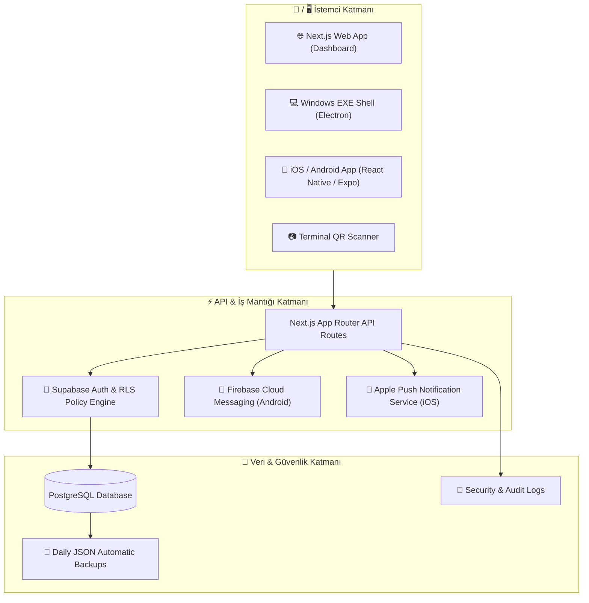

# Hesap Rapor Sistemi

<p align="center">
  
</p>

<p align="center">
  <strong>Gelir, gider, kargo cari, vardiya, QR mesai, maaş, cihaz lisanslama ve yedeklemeyi tek panelde buluşturan production-grade işletme yönetim sistemi.</strong>
</p>

<p align="center">
  <a href="https://github.com/wasycim/hesap"></a>
  
  
  
  
  
</p>

<p align="center">
  
  
</p>

---

## 📋 İçindekiler

- [Özet](#-özet)
- [Ekran Görselleri](#-ekran-görselleri)
- [Sistem Mimarisi](#-sistem-mimarisi)
- [Detaylı Modül Rehberi](#-detaylı-modül-rehberi)
  - [1. Finans & Şube Gider Yönetimi](#1-finans--şube-gider-yönetimi)
  - [2. Personel, Maaş & Orantılı (Kıst) Kargo Primi](#2-personel-maaş--orantılı-kıst-kargo-primi)
  - [3. Modern Takvim & İşten Çıkış Yönetimi (`ExitDatePicker`)](#3-modern-takvim--işten-çıkış-yönetimi-exitdatepicker)
  - [4. Kargo Cari & Firma Yönetimi](#4-kargo-cari--firma-yönetimi)
  - [5. QR & Terminal Mesai Takibi](#5-qr--terminal-mesai-takibi)
  - [6. Cihaz Bazlı Lisanslama (iOS, Android, EXE)](#6-cihaz-bazlı-lisanslama-ios-android-exe)
  - [7. Push Bildirimler (FCM & APNs)](#7-push-bildirimler-fcm--apns)
  - [8. Güvenlik, Audit Log & Otomatik Yedekleme](#8-güvenlik-audit-log--otomatik-yedekleme)
- [Veritabanı Şeması & Tablolar](#-veritabanı-şeması--tablolar)
- [API Endpoint Rehberi](#-api-endpoint-rehberi)
- [Teknoloji Stack](#-teknoloji-stack)
- [Proje Dizin Yapısı](#-proje-dizin-yapısı)
- [Kurulum & Çalıştırma](#-kurulum--çalıştırma)
- [Ortam Değişkenleri (`.env.local`)](#-ortam-değişkenleri-envlocal)
- [Lisans](#-lisans)

---

## 📌 Özet

**Hesap Rapor Sistemi**; çok şubeli işletmelerin günlük finansal hareketlerini, personel mesailerini, maaş & kıst prim hesaplamalarını, kargo borç cari takiplerini, cihaz erişim lisanslarını ve otomatik veri yedeklemelerini tek platformda toplayan production-ready bir yazılım mimarisidir.

Web (Next.js 15), Windows Masaüstü (Electron EXE) ve Mobil (iOS / Android) istemcileri aynı merkezi veritabanı ve API katmanına bağlı çalışır.

---

## 🖼️ Ekran Görselleri

<details>
  <summary>📸 <strong>Mobil ve Store Ekran Önizlemeleri (Tıklayın)</strong></summary>
  <br />
  <p align="center">
    
  </p>
  <p align="center">
    
    &nbsp;&nbsp;&nbsp;&nbsp;
    
  </p>
</details>

---

## 📐 Sistem Mimarisi


```mermaid
flowchart TD
    subgraph Clients["📱 / 🖥️ İstemci Katmanı"]
        WEB["🌐 Next.js Web App (Dashboard)"]
        EXE["💻 Windows EXE Shell (Electron)"]
        MOB["📱 iOS / Android App (React Native / Expo)"]
        QR["📷 Terminal QR Scanner"]
    end

    subgraph ServiceLayer["⚡ API & İş Mantığı Katmanı"]
        API["Next.js App Router API Routes"]
        AUTH["🔐 Supabase Auth & RLS Policy Engine"]
        FCM["🔔 Firebase Cloud Messaging (Android)"]
        APNS["🍎 Apple Push Notification Service (iOS)"]
    end

    subgraph StorageLayer["🐘 Veri & Güvenlik Katmanı"]
        DB[(PostgreSQL Database)]
        AUDIT[📜 Security & Audit Logs]
        BACKUP[💾 Daily JSON Automatic Backups]
    end

    Clients --> API
    API --> AUTH
    AUTH --> DB
    API --> FCM
    API --> APNS
    API --> AUDIT
    DB --> BACKUP
```

---

## 🔍 Detaylı Modül Rehberi

### 1. Finans & Şube Gider Yönetimi
- **Dinamik Sütun Özelleştirme:** Her şube kendi özel masraf kalemlerini (Örn: Yakıt, Temizlik, Mutfak vb.) sütun olarak ekleyebilir.
- **Tarih Sıralaması:** Tüm gelir-gider harcamaları yeniden eskiye doğru (`DESC`) listelenir.
- **Dışa Aktarım:** Aylık harcamalar tek tıkla PDF veya Excel biçiminde raporlanır.

### 2. Personel, Maaş & Orantılı (Kıst) Kargo Primi
- **Kıst Prim Hesaplama:** Ay ortasında (örneğin 15 Ağustos'ta) ayrılan personel Kargo Prim listesinde seçilirse, prim tutarı ayın çalıştığı günü oranında (örn: 15/31 gün) otomatik olarak orantılanarak hesaplanır. Seçilmezse 0 ₺ yansıtılır.
- **Geçmiş Logların Korunması:** Bir personel çıkış yapsa dahi, geçmiş aylardaki (örneğin Temmuz) tüm prim ve maaş logları eksiksiz görüntülenir.
- **Maaş Hakediş Formülü:**
  $$\text{Net Maaş} = \text{Banka Maaş} + \text{Nakit Maaş} + \text{Mesai Hakediş} + \text{Kargo Prim} - \text{Avans} - \text{Çorba Gideri}$$

### 3. Modern Takvim & İşten Çıkış Yönetimi (`ExitDatePicker`)
- **Türkçe Tarih Seçici:** Popover takvim bileşeni Türkçe ay/gün isimleri, *Bugün*, *Ay Sonu* ve *Temizle* hızlı eylemleri sunar.
- **Otomatik Pasife Alma:** Çıkış tarihi gelen veya geçen personeller sistem tarafından otomatik pasif duruma aktarılır.
- **Geri Aktif Etme:** İptal edilen personel aktif edildiğinde çıkış tarihi otomatik olarak temizlenir.

### 4. Kargo Cari & Firma Yönetimi
- **Matematiksel Prim Dağıtım Modeli:**
  $$\text{İşçi Havuzu (%5)} = \left(\frac{\text{Toplam Ciro}}{1.20} - \frac{\text{KDV'siz Tutar}}{6}\right) \times 0.05$$
- **Firma Detay Notları:** Kargo firmaları için aylık detay notları tutulur, bu notlar PDF cari raporlarına otomatik eklenir.

### 5. QR & Terminal Mesai Takibi
- **Terminal Eşleştirme:** 6 haneli onay kodu ile restoran/ofis terminal cihazı eşleştirilir.
- **Vardiya Planı:** Gündüz ve gece vardiyaları, mola saatleri ve anlık konum doğrulama.

### 6. Cihaz Bazlı Lisanslama (iOS, Android, EXE)
- **Filtrelenmiş İstemci Lisansları:** Cihaz lisansları sayfasında ve API katmanında `web` tarayıcı oturumları gizlenir. Sadece yetkili **Android**, **iOS** ve **Windows (EXE)** cihazları listelenir.
- **Anlık İptal / Aktif Etme:** Şüpheli cihaz erişimleri tek tıkla engellenebilir (`revoked_at`).

### 7. Push Bildirimler (FCM & APNs)
- Mobil cihaz kayıtları sırasında güvenli `push_token_hash` tutulur.
- Android için FCM (Firebase Cloud Messaging) ve iOS için APNs (Apple Push) entegrasyonu mevcuttur.

### 8. Güvenlik, Audit Log & Otomatik Yedekleme
- **Security Events (`security_events`):** Cihaz lisansı iptali, personel hard-delete, şifre değişikliği ve yetki atamaları loglanır.
- **Canlı Önizlemeli Yedekleme:** Veritabanı günlük olarak JSON formatında yedeklenir ve panel üzerinden geri yüklenebilir.

---

## 🗄️ Veritabanı Şeması & Tablolar

| Tablo Adı | Açıklama |
| :--- | :--- |
| `personeller` | Personel kimlik, maaş, şube ve `isten_cikis_tarihi` bilgileri |
| `gider_kayitlari` | Günlük şube harcama ve masraf verileri |
| `kargo_prim_kayitlari` | Aylık kargo cirosu ve seçili personel prim dağıtım listeleri |
| `corbalar` | Günlük personel çorba/yemek giderleri |
| `device_licenses` | İzinli mobil (iOS, Android) ve desktop (EXE) cihaz lisansları |
| `user_devices` | Mobil push notification token ve cihaz durumları |
| `security_events` | İşlem ve güvenlik denetim logları (Audit Trail) |
| `overtime_approvals` | Yönetici mesai ve fazla çalışma onayları |

---

## 🔌 API Endpoint Rehberi

```text
GET  /api/dashboard/gider          # Aylık gider kayıtları ve personel payları
POST /api/dashboard/gider          # Yeni gider/masraf kaydı oluşturma
GET  /api/dashboard/mesai-takip    # Vardiya ve QR mesai logları
GET  /api/admin/device-licenses    # İzinli Mobil & EXE cihaz lisans listesi (Web hariç)
PATCH /api/admin/device-licenses   # Cihaz lisansı aktif/pasif durumu güncelleme
POST /api/mobile/salary            # Mobil uygulama için detaylı maaş ve prim servisi
POST /api/mobile/register-device   # Mobil push token ve cihaz kaydı
POST /api/terminal/qr              # QR kodu doğrulama ve mesai başlatma
GET  /api/admin/log-backup         # JSON veritabanı yedek alma ve canlı önizleme
```

---

## 🛠️ Teknoloji Stack

| Katman | Kullanılan Teknolojiler |
| :--- | :--- |
| **Frontend** | Next.js 15 (App Router), React 19, TypeScript (Strict) |
| **Stil & UI** | TailwindCSS, Lucide Icons, Shadcn UI, Sonner Toast |
| **Veritabanı** | Supabase (PostgreSQL, Row Level Security, Realtime) |
| **Masaüstü Shell** | Electron, Capacitor Desktop |
| **Mobil Shell** | React Native, Expo, Capacitor Mobile Bridge |
| **Bildirimler** | Firebase Cloud Messaging (FCM), Apple Push Notification (APNs) |

---

## 📂 Proje Dizin Yapısı

```text
hesap/
├── app/                      # Next.js App Router sayfaları ve API servisleri
│   ├── api/                  # Backend REST servisleri
│   │   ├── admin/            # Lisans, sistem sağlığı ve yedekleme
│   │   ├── dashboard/        # Gider, mesai, kargo prim ve maaş servisleri
│   │   └── mobile/           # Mobil entegrasyon servisleri
│   ├── auth/                 # Giriş ve cihaz doğrulama sayfaları
│   └── dashboard/            # Yönetim paneli (Maaşlar, Ayarlar, Lisanslar vb.)
├── components/               # UI ve iş bıleşenleri
│   ├── dashboard/            # Panel bileşenleri
│   ├── mesai/                # QR okuyucu ve vardiya bileşenleri
│   └── ui/                   # Button, Input, ExitDatePicker, Popover vb.
├── contexts/                 # React Context (Şube ve Yetki durumu)
├── lib/                      # İş mantığı, Supabase istemcileri, audit servisleri
├── public/                   # Görsel varlıklar ve ikonlar
└── scripts/                  # SQL migrasyon ve şema güncelleme betikleri
```

---

## 🚀 Kurulum & Çalıştırma

### 1. Projeyi Klonlayın
```bash
git clone https://github.com/wasycim/hesap.git
cd hesap
```

### 2. Bağımlılıkları Yükleyin
```bash
npm install
```

### 3. Ortam Değişkenlerini Oluşturun
Proje kök dizininde bir `.env.local` dosyası oluşturun:
```env
NEXT_PUBLIC_SUPABASE_URL=https://your-supabase-project.supabase.co
NEXT_PUBLIC_SUPABASE_ANON_KEY=your-supabase-anon-key
SUPABASE_SERVICE_ROLE_KEY=your-supabase-service-role-key
```

### 4. Geliştirici Sunucusunu Çalıştırın
```bash
npm run dev
```
Uygulama `http://localhost:3000` adresinde açılacaktır.

---

## 📄 Lisans

Bu yazılım projesi özel kullanım için geliştirilmiştir. Tüm hakları saklıdır.  
Detaylı bilgi için [LICENSE](LICENSE) belgesini inceleyebilirsiniz.
